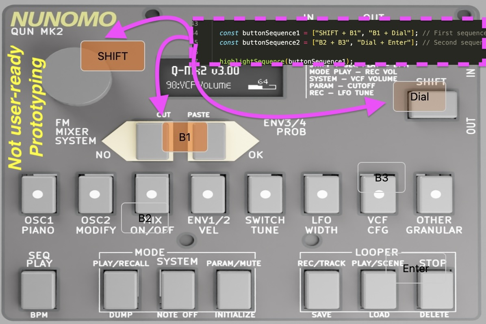

# Visualize control surface

* Flashes buttons on an otherwise static UI
* Responds to signals from a WebSocket server
* Intended for use with [Qun mk2](https://github.com/raspy135/Qun-mk2)
* Could be adapted to any static UI, to preview usage "flash buttons"

# Limitations

* Not ready for usage by users
* Flashes a few buttons on reload

# Future

- [ ] Get the WebSocket server working to send / receive commands

# Usage
## Prerequisites

* pip install websockets
* npm install http-server -g

## Launch

* in one shell: http-server
* in another shell: python3 websocket_server.py

* navigate to http://localhost:8080

## Troubleshooting

* Only tested on macOS Sonoma 14.2.1
* Test if websocket server is running with
  * npm install -g wscat
  * wscat ws://localhost:8765
